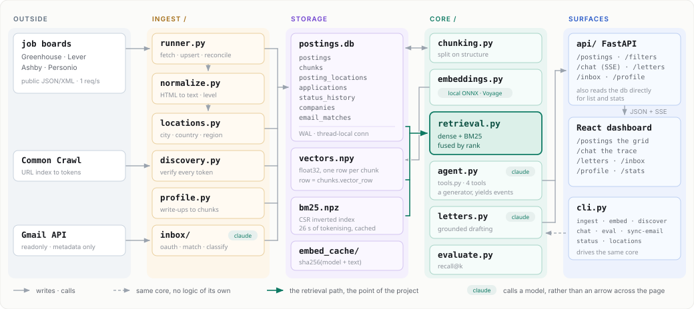

# Screener

A private job search agent. It pulls postings from public job
board APIs onto your machine, indexes them for hybrid search, gives you an agent
that can filter and triage them, works out which of your own projects are worth
putting in front of a given posting and helps you phrase them, and reads your
inbox to suggest what happened to the applications you sent.

Everything runs locally. One SQLite file, one numpy array, one inverted index.

`4 boards` · `24,533 postings` · `579 companies` · `135,934 embedded chunks` ·
`94.4% of locations resolved` · `~2s search`

<video src="https://github.com/Arash-ethz-1/job-agent/releases/download/demo-assets/screener-demo.mp4" controls width="100%"></video>

[**Watch the walkthrough**](https://github.com/Arash-ethz-1/job-agent/releases/download/demo-assets/screener-demo.mp4) — 4 minutes: the corpus and its filters, the agent picking its own filters and re-searching when the results are wrong, the screen removing quant trading roles from a machine learning search, grounded letter drafting, and the inbox suggesting what happened to an application without acting on it.

This is a learning project. [`plan.md`](plan.md) is the spec and takes precedence
over this file; [`PROGRESS.md`](PROGRESS.md) is the engineering log and
[`CAPABILITIES.md`](CAPABILITIES.md) is the inventory of what is built.

---

## What it does

**Finds postings.** Four ATS vendors, ingested from their public APIs:
Greenhouse, Lever, Ashby and Personio. No scraping. Company discovery widens the
corpus from Common Crawl, an LLM, or a file of names, and a board token is only
believed once it answers 200. A posting that disappears from a board is marked
closed rather than deleted, because the letter you wrote still points at it.

**Resolves locations.** Board location strings are prose: `Zürich`, `CH-Zurich`,
`Massachusetts - Boston`, `München; Köln`. An offline table turns those into
city, ISO country and region at 94.4% coverage, so "jobs in Europe" is a filter
rather than a wish. It returns 6,662, and narrowing that to intern level leaves
173.

**Searches.** Dense vectors for meaning, BM25 for the exact words, fused by
reciprocal rank. A precomputed inverted index took a query from 26 seconds to
about 2. The two halves are scored separately, so the trace panel can show which
one earned a result its rank, as a bar that adds up to the score.

**Keeps your decisions straight.** `not_relevant` means you passed; `rejected`
means they passed on you. Conflating those is how a pipeline ends up reading as
thirty rejections you never received. Untriaged is the absence of a row, not a
status.

**Tells you what to mention.** For a given posting it retrieves the most
relevant extracts from your own write-ups, from the same index as the postings,
and works up phrasing you can take or leave. Everything it puts forward is
grounded in something you actually wrote: where a detail is missing it leaves a
`[TODO: ...]` marker rather than inventing one, and it refuses to run at all when
there is nothing to ground in, which is the point rather than a limitation.
Revision applies one instruction to what is already there rather than rolling a
new one, with the grounding extracts unchanged, so an edit cannot invent a fact
to fill the gap it opened. What comes out is a starting point you rewrite in your
own words, not something to send as it stands.

**Reads the replies.** Gmail, read only, matched to your applications and
classified as rejection, interview, offer or other. Then it stops: every result
is a suggestion in a review queue, and accepting one is what moves the
application. A wrongly auto-filed rejection is worse than no automation, because
you stop checking on a company that wanted to interview you.

---

## How it fits together

Five layers. One SQLite file and one `.npy` array are the only shared state, and
everything else writes into them or reads out of them.



Three rules the diagram enforces:

* `core/` never imports from `ingest/`. The only thing both halves share is
  `db.Posting`.
* The CLI and the API are two doorways into the same `core/`, and neither holds
  logic of its own. That is why every feature is reachable from a terminal.
* The retrieval path is the point of the project. Everything else keeps it fed.

A longer illustrated walkthrough, twelve sections with per-layer diagrams, is in
the [Anatomy of the Screener](https://claude.ai/code/artifact/28aace07-d610-43ca-926b-e24b42b3301b)
canvas. It was drawn on 2026-09-01 and predates the location layer, the inbox and
the local embedding provider, so the diagram above is the current shape.

---

## Setup

Requires Python 3.11+, [uv](https://docs.astral.sh/uv/), and Node 20+.

```bash
cd backend && uv sync --extra dev     # backend deps
cd ../frontend && npm install         # frontend deps
cp backend/.env.example backend/.env  # then fill in the keys
```

Neither API key is needed to ingest postings or browse them. They are required
only where they are used, and the error names the missing variable.

| Variable | Needed for | Where to get it |
|---|---|---|
| `ANTHROPIC_API_KEY` | the agent, letter drafting, email classification | <https://console.anthropic.com/settings/keys> |
| `VOYAGE_API_KEY` | embeddings, and only with `EMBEDDING_PROVIDER=voyage` | <https://dashboard.voyageai.com/api-keys> |
| `GOOGLE_CLIENT_ID` / `GOOGLE_CLIENT_SECRET` | `sync-email` only | <https://console.cloud.google.com/apis/credentials> |

None of these come with a Claude subscription: the Claude API bills separately
through the Console, and Voyage and Google are other vendors again.

Embeddings do not need a key at all by default. `EMBEDDING_PROVIDER=local` runs a
small multilingual ONNX model on this machine through `fastembed`, so
re-embedding the corpus while tuning chunking costs nothing but time, which
matters because tuning retrieval means doing it repeatedly. Set
`EMBEDDING_PROVIDER=voyage` to use the API instead; Anthropic has no embeddings
endpoint, which is why that path is a second vendor.

Changing `EMBEDDING_PROVIDER`, `EMBEDDING_MODEL` or `EMBEDDING_DIM` invalidates
`data/vectors.npy`; the app refuses to mix vector spaces rather than silently
returning nonsense. Delete `data/vectors.npy` and `data/vectors.meta.json`, then
re-run `cli embed`.

Each model is configured separately, so a cost decision about one does not leak
into another:

```bash
LETTER_MODEL=claude-sonnet-5        # the only output a person will read
AGENT_MODEL=claude-haiku-4-5        # a tool choosing loop
DISCOVERY_MODEL=claude-haiku-4-5
CLASSIFIER_MODEL=claude-haiku-4-5
```

## Running

```bash
python dev.py          # API on :8000 and Vite on :5173
python dev.py api      # API only
python dev.py web      # frontend only
python dev.py test     # ruff check + pytest
python dev.py lint     # ruff + ruff format --check + tsc + eslint
```

Then open <http://localhost:5173>, using `localhost` rather than `127.0.0.1`;
Vite binds to the first one, and checking the other looks like the server is
down. Six surfaces: `/postings` (the screener), `/chat` (the agent),
`/letters/:id`, `/inbox` (email suggestions), `/profile` (the write-ups it
draws on) and `/stats`.

`plan.md` asks for a Makefile or justfile; neither `make` nor `just` is installed
on the development machine, so `dev.py` is the task runner. Python is already a
hard requirement, so this adds nothing to install.

## CLI

```bash
cd backend
uv run python -m agent_app.cli --help
uv run python -m agent_app.cli init-db
```

Subcommands are added by the phase that makes them meaningful: `ingest`
(Phase 2), `embed` (Phase 4), `ingest-profile` (Phase 5), `draft-letter`
(Phase 6), `chat` / `status` / `eval` (Phase 9), and `sync-email` (Phase 10).

## First run, in order

Ingesting and embedding need no keys; the agent, letters and the email classifier
need `ANTHROPIC_API_KEY`.

```bash
cd backend
uv run python -m agent_app.cli ingest          # fetch every board
uv run python -m agent_app.cli embed           # chunk + embed
uv run python -m agent_app.cli ingest-profile  # chunk + embed profile/
uv run python -m agent_app.cli status          # what is in the database
```

On a full corpus `embed` is the slow one; see **Embedding a lot of chunks** below.

## Every so often

Boards change, so the loop is: fetch, embed what is new, read the replies.

```bash
cd backend

# 1. New and changed postings. Idempotent: re-running does not duplicate, and
#    a posting that disappears from a board is kept, not deleted. Chunking runs
#    as part of it, so new postings are keyword-searchable immediately.
uv run python -m agent_app.cli ingest

# 2. Give the new chunks vectors. Only the new ones: anything with a vector is
#    skipped, and repeated text comes from the on-disk cache.
uv run python -m agent_app.cli embed

# 3. What has the pipeline got now?
uv run python -m agent_app.cli status
```

Widening the search is a separate command, because verifying company boards is
slow and you will not want it on every run:

```bash
uv run python -m agent_app.cli discover --from crawl --source ashby --limit 50
uv run python -m agent_app.cli discover --from llm --query "robotics companies in Switzerland"
uv run python -m agent_app.cli discover --from file --file names.txt
uv run python -m agent_app.cli companies       # what was verified, what was dead
```

`discover` never trusts a token because a model produced it: a token is real when
the board answers 200, and failures are recorded so the same candidate is never
checked twice.

Places are parsed as part of ingest, and can be re-run on their own:

```bash
uv run python -m agent_app.cli locations              # resolve what is unparsed
uv run python -m agent_app.cli locations --unresolved # the worklist, most common first
uv run python -m agent_app.cli locations --rebuild    # after widening the tables
```

To read the replies to applications you have already sent, see **Tracking
applications from email** below:

```bash
uv run python -m agent_app.cli sync-email
```

## Embedding a lot of chunks

`embed` is safe to re-run and safe to interrupt: chunks that already have a
vector are skipped, and it checkpoints as it goes. It also rebuilds the keyword
index in `data/bm25.npz` when the chunks table has moved on. BM25 reads that
instead of re-tokenising the corpus on every query, which is the difference
between a search taking 26 seconds and 2.

The local model manages roughly **1.7 chunks a second** on a laptop CPU, which is
fine for the few hundred chunks an `ingest` run adds and useless for a full
corpus: 135,000 chunks is about 22 hours. For that, the embedding runs somewhere
with a GPU and only the text and the vectors travel:

```bash
uv run python -m agent_app.cli embed --export ../data/pending.jsonl
#   ... run cluster/embed_chunks.py wherever the compute is ...
uv run python -m agent_app.cli embed --import ../data/vectors.npz
```

`backend/cluster/README.md` has the whole round trip for the ETH TIK cluster: the
conda environment, the `sbatch` script, and why the same library has to run on
both ends. `--export` changes nothing in the database and `--import` skips chunks
that already have a vector, so both are safe to repeat.

Rule of thumb: a normal `ingest` adds few enough chunks to embed locally over
lunch. Re-chunking the whole corpus does not.

## Once postings are embedded

```bash
uv run python -m agent_app.cli chat                  # the agent, in the terminal
uv run python -m agent_app.cli draft-letter <id>     # grounded phrasing for one posting
uv run python -m agent_app.cli eval                  # retrieval numbers
```

Two of those need content, not code. `draft-letter` refuses unless `profile/`
holds real write-ups, because anything it produced with nothing to ground it in
would be invented, so the refusal is the feature; see `profile/README.md` for the
format.
And `eval` reads `data/eval/queries.jsonl`, one hand-labelled line per query:

```json
{"query": "remote ML internships in Europe", "relevant_posting_ids": ["greenhouse:123"], "note": "why these count"}
```

Nothing can label those but a person. A few dozen lines is enough to turn "this
chunk size feels better" into a number that moves.

## Tracking applications from email

Once a few postings are marked applied, `sync-email` reads the replies:

```bash
cd backend
uv run python -m agent_app.cli sync-email --login   # once: opens a browser
uv run python -m agent_app.cli sync-email           # every time after
```

It fetches messages received since your earliest application, matches each to a
posting, and classifies it as a rejection, an interview invitation, an offer, or
something else. Then it **stops**. Every result is a suggestion in the `/inbox`
review queue; accepting one is what moves the application, and the
`status_history` note records which email caused it.

That separation is the whole point. A wrongly auto-applied `rejected` is worse
than no automation at all, because you stop checking a company that actually
wanted to interview you.

Setup is a Google Cloud project with the Gmail API enabled and an OAuth client of
type **Desktop app**; `.env.example` has the steps. Three properties hold by
construction rather than by care:

- the only scope requested is `gmail.readonly`, and there is no code path that
  sends, labels or deletes anything;
- messages are fetched with `format=metadata`, so Gmail never sends a body and
  there is no body to store;
- the refresh token lives in `data/gmail_token.json`, which is gitignored.

`plan.md` specifies the OAuth *device* flow. Google restricts that flow to a
fixed scope list that does not include any Gmail scope, so the flow used is the
one Google documents for desktop apps: a loopback redirect to `127.0.0.1` on an
ephemeral port, with PKCE. Every property the plan asked for is unchanged.

---

## How this was built

Nine functions, the chunking, the retrieval, the agent loop, the tool
descriptions and the evaluation, were reserved to be written by hand rather than
delegated, because they are the parts worth understanding. See the Category B
table in `plan.md`.

All nine are now written and the app runs end to end. The problem statements
survive as a problem book, and their tests as a regression suite for rewriting
any of them:

```bash
cd backend
uv run python check.py          # the scoreboard: 9/9, 69 tests
uv run python check.py 6 -v     # one problem, with its failures
uv run python try_chunking.py   # chunking output on a real posting
```

These tests live outside the main suite, so `pytest` and CI stay green while a
function is being rewritten.

## Layout

```
backend/    Python package `agent_app`: ingest, inbox, core, api, cli
frontend/   Vite + React 19 + TypeScript + Tailwind v4
profile/    project write-ups, gitignored except the README and example
data/       sqlite, vectors.npy, bm25.npz, embedding cache, letters: gitignored
```

## Dependency justifications

`plan.md` asks for one line per dependency.

**Backend.** `httpx`: one HTTP client for the job boards, the embeddings API and
Gmail, so retry and backoff are written once. `numpy`: the vector store is a
single array, and brute-force cosine is correct at this corpus size.
`python-dotenv`: keeps keys out of the repo. `anthropic`: the agent's model
client, and the email classifier's. `fastembed`: runs the embedding model locally
as ONNX, so the corpus can be re-embedded for free while chunking is being tuned;
chosen over `sentence-transformers` because that pulls PyTorch (~2.5 GB) to do
the same job. `fastapi` + `uvicorn`: the API layer. `pytest`, `ruff`: tests and
lint. No `voyageai` client: Phase 4 requires hand-written batching and backoff, so
a client that already does that would be redundant. No Google client libraries:
Gmail is two GETs and the OAuth exchange is one POST, so `httpx` and the standard
library cover it without adding three packages to hold mailbox credentials.

**Frontend.** `react`, `react-dom`, `vite`, `typescript`: the stack.
`tailwindcss` + `@tailwindcss/vite`: styling from the tokens. `react-markdown`:
the agent answers in markdown, and a paragraph of `**bold**` and `1.` shown as
source is not an answer; every element is mapped to this app's own classes rather
than a prose stylesheet. `@tanstack/react-query`: server state.
`@tanstack/react-table`: headless grid. `@tanstack/react-virtual`: a few hundred
36px rows need virtualising and the table is headless. `react-router`: the routes
need a router. `@radix-ui/*`: dialog, dropdown, tooltip and popover behaviour
only, styled from the tokens. `@fontsource-variable/geist{,-mono}`: self-hosted
Geist, so the app makes no third-party font request. `eslint` and plugins: lint.

No vector database, no agent framework, no chart library.
